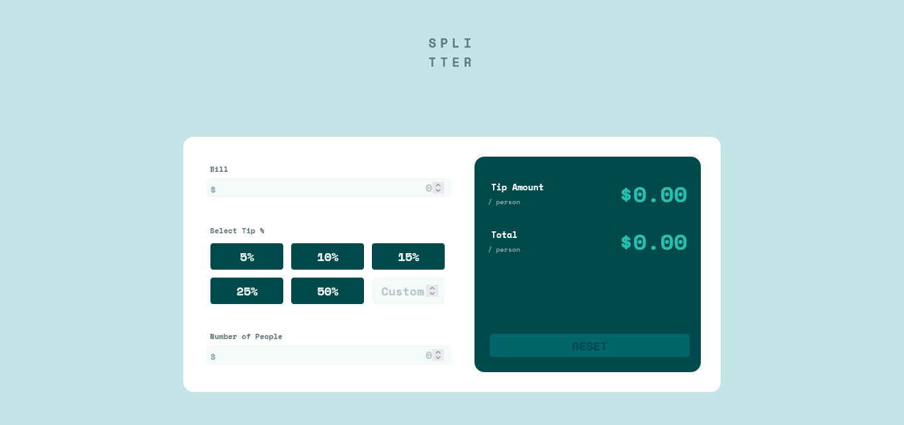

# Frontend Mentor - Tip calculator app solution

This is a solution to the [Tip calculator app challenge on Frontend Mentor](https://www.frontendmentor.io/challenges/tip-calculator-app-ugJNGbJUX). Frontend Mentor challenges help you improve your coding skills by building realistic projects.

## Table of contents

- [Overview](#overview)
  - [The challenge](#the-challenge)
  - [Screenshot](#screenshot)
  - [Links](#links)
- [My process](#my-process)
  - [Built with](#built-with)
  - [Useful resources](#useful-resources)
- [Author](#author)

## Overview

### The challenge

Users should be able to:

- View the optimal layout for the app depending on their device's screen size
- See hover states for all interactive elements on the page
- Calculate the correct tip and total cost of the bill per person

### Screenshot

### Links

- Solution URL: [Add solution URL here](https://your-solution-url.com)
- Live Site URL: [Add live site URL here](https://your-live-site-url.com)

## My process

I began by mapping out the HTML, laying out the div with as much foresight as possible. I then began working on the Javascript portion. All of the variables were saved at the top of the file, ]then the mathematical functions were defined. Then came the DOM manipulation. Event listeners were added by grouping the various elements and using the forEach method. Lastly, the layout was done, which proved to be the most difficult task. Flexbox was used to achieve the resulting layout.

### Built with

- Semantic HTML5 markup
- CSS custom properties
- Flexbox
